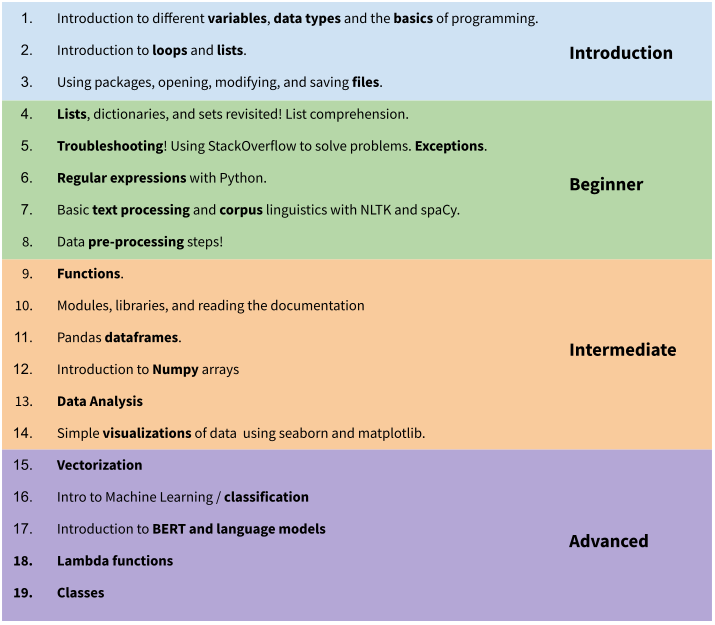

# EADH
**Coding for Digital Humanities**
Python Notebooks for EADH

This is the pre-launch version of the "Coding for Digital Humanities" project funded by a **European Association for Digital Humanites (EADH) small grant** in 2021. It consists of 4 main notebooks that offer a steady progression in hands-on Python programming skills from complete beginner to advanced. You can choose your notebook based on your existing skill-/knowledge level.

*This notebook has been created by Emily Öhman, Assistant Professor of Digital Humanities at Waseda University, Japan.*

This is the first step to learning Python. The target audience for these tutorials is digital humanities, and other cross-disciplinary scholars and students who are not aiming to become programmers as such, but who wish to gain code literacy and the tools to do most of the computational side of their research themselves.

Many of the topics covered in these notebooks could be their own full courses, which is why they are not presented in depth, but rather the learner is given an overview (see image) and plenty of links for further study.

## Introduction
**The first notebook**, called the *introdcutory* notebook, goes through the very basics of Python programming from commenting to data types such as integers, floats, and strings, to the concept of loops as well as how to open a file in Python.
## Beginner
**The second notebook**, the *beginner* notebook, delves deeper into lists (including list comprehension), dictionaries, and sets and focuses on skills relevant specifically for computational humanities and social sciences such as pre-processing steps for textual data including regular expressions and the Natural Language Toolkit (NLTK). Troubleshooting and probelm-solving is also discussed.

## Intermediate
**The third notebook**, the *intermediate* notebook, looks at functions and classes as well as more advanced NLTK topics. Pandas, numpy, visualizations and data analysis in general is also introduced.

## Advanced
**The fourth** and final, *advanced*, notebook introduces lambda functions, machine learning and classification, as well as the basic ideas behind classes.

## Special topics
Additional, special topic notebooks will be added to the project in time. Feel free to suggest topics you are interested in! Currently special topics will include topic modeling, network analysis, and sentiment analysis.
Another upcoming addition to these notebooks is accompanying them with videos. 

---

Together all of these notebooks offers a clear progression from beginner to advanced and links to other relevant resources and tutorials that will help you focus on the topics you are interested in the most or feel that you need the most training in. Other resources include online books, tutorials, websites, and videos.

***The best way to learn to program, is to write code yourself. Find a project you are interested in and try to implement it using your new skills.***
